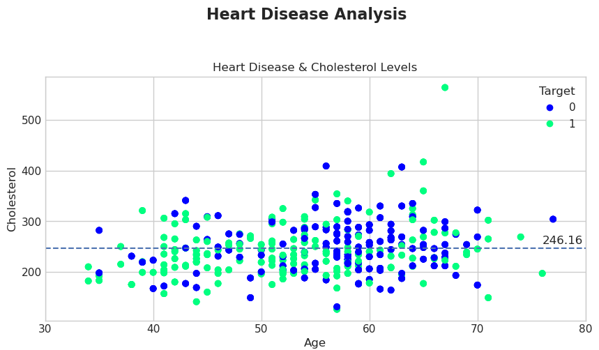
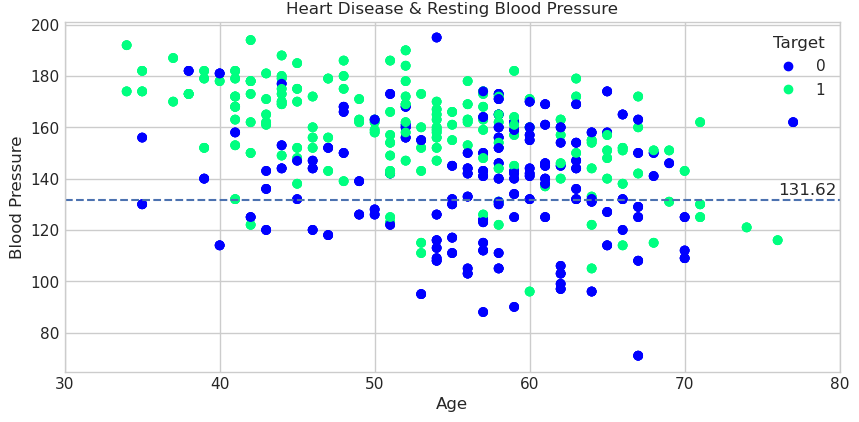
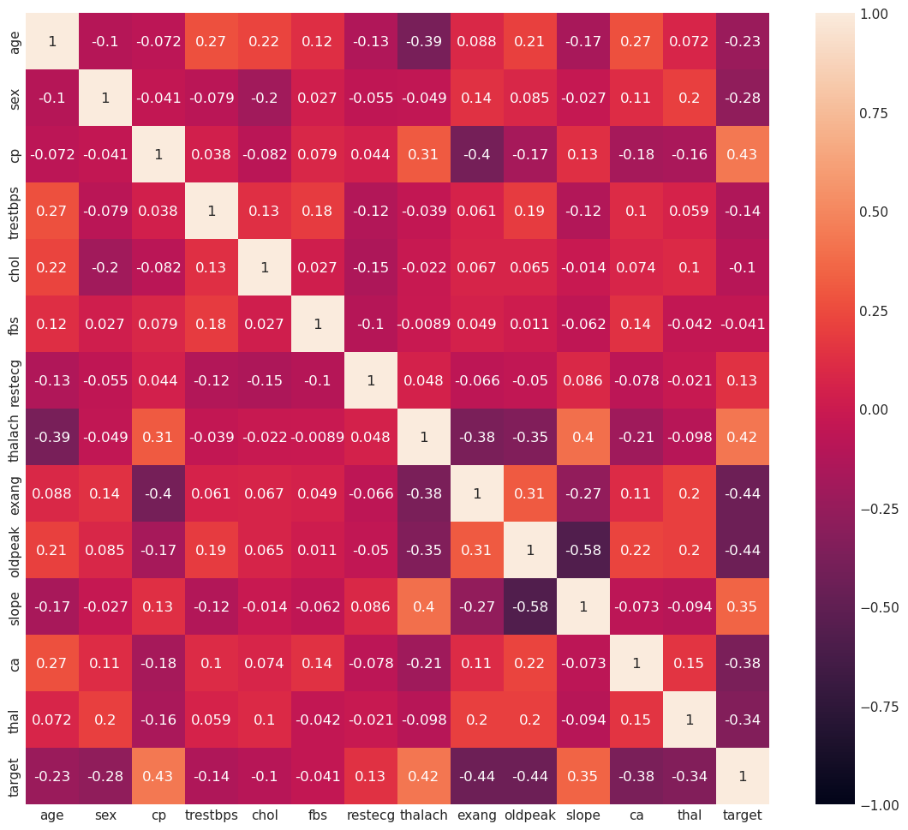
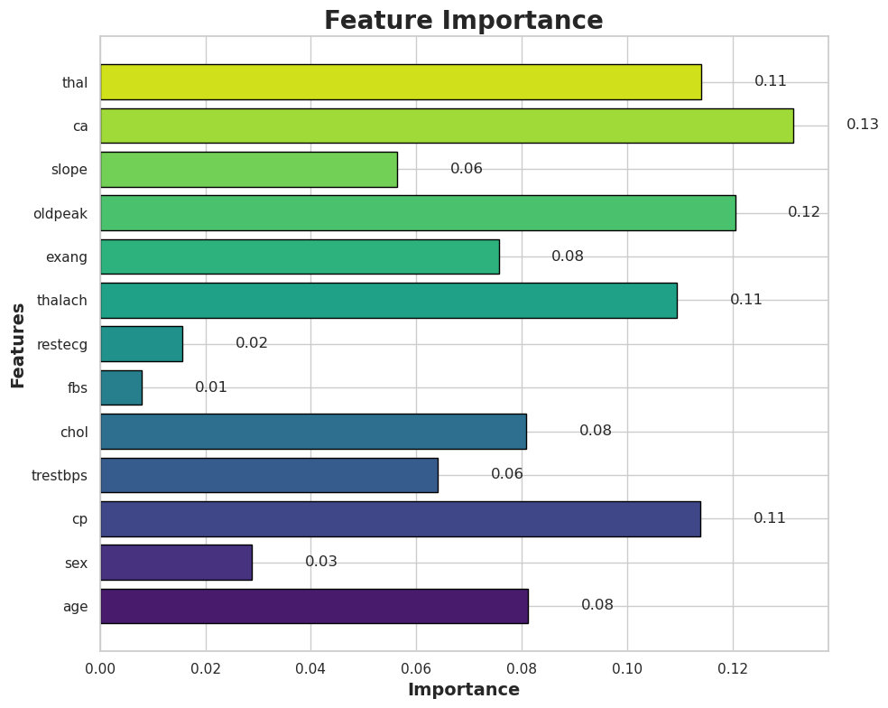
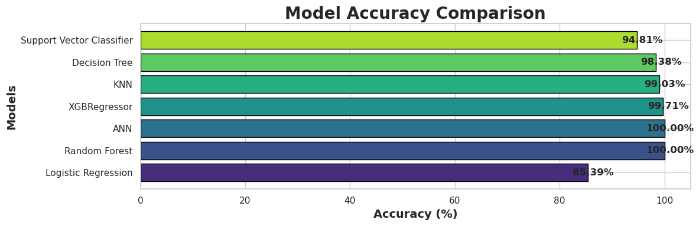

# 🩺 Heart Disease Prediction using Machine Learning


## 📌 Project Overview
This repository presents a comprehensive analysis and prediction model for heart disease using machine learning techniques. The dataset consists of patient records indicating whether they have heart disease or not. The workflow includes data preprocessing, exploratory data analysis (EDA), model training, evaluation, and performance comparison.

---

## 📊 Exploratory Data Analysis (EDA)
To understand the dataset better, the following visualizations were performed:

- **Cholesterol vs. Age** 📈
- **Blood Pressure vs. Age** 📉
- **Heatmap of Feature Correlations** 🔥

<p align="center">
  
  
  
</p>

---

## ⚙️ Data Preprocessing
- Data Cleaning
- Handling Missing Values
- Feature Scaling
- **SMOTE** (Synthetic Minority Over-sampling Technique) for handling class imbalance
- Splitting into Train-Test Sets

---

## 🤖 Machine Learning Models Used
A total of **7 models** were trained and evaluated:

| Model | Accuracy |
|--------|----------|
| Logistic Regression | 85.39% |
| Random Forest | 100.00% |
| Artificial Neural Network (ANN) | 100.00% |
| XGBoost Regressor | 99.70% |
| K-Nearest Neighbors (KNN) | 99.03% |
| Decision Tree | 98.38% |
| Support Vector Classifier | 94.81% |

📌 **Model Evaluation**
- **Confusion Matrices** were generated to analyze performance.
- A **Feature Importance Graph** was plotted for interpretability.
- A **Bar Chart Comparison of Accuracy Scores** was created.

<p align="center">
  
  
</p>

---

## 📌 Key Takeaways
✅ High-performing models such as Random Forest, ANN, and XGBoost achieved near-perfect accuracy.  
✅ Logistic Regression performed reasonably well, but with lower accuracy compared to ensemble models.  
✅ Feature Importance analysis provided valuable insights into which factors contribute most to heart disease prediction.

---

## 🚀 How to Run the Project
### 1️⃣ Clone the Repository
```bash
 git clone https://github.com/your-username/heart-disease-prediction.git
 cd heart-disease-prediction
```

### 2️⃣ Install Dependencies
```bash
pip install -r requirements.txt
```

### 3️⃣ Run the Jupyter Notebook
```bash
jupyter notebook
```
Open the `.ipynb` file and execute the cells step by step.

---

## 🛠️ Technologies Used
- **Python** 🐍
- **Pandas, NumPy** for Data Processing 📊
- **Matplotlib, Seaborn** for Data Visualization 🎨
- **Scikit-Learn, XGBoost, TensorFlow** for Model Training 🤖

---

## 📝 Conclusion
This project demonstrates how machine learning can effectively classify heart disease patients using various algorithms. The results highlight the effectiveness of ensemble models and deep learning techniques.

⭐ Feel free to **star** this repo if you found it useful!

📫 Reach me at [pandeytushart522@gmail.com](mailto:pandeytushart522@gmail.com) or connect on [LinkedIn](https://linkedin.com/in/tushar-pandey-ab94a418a)

